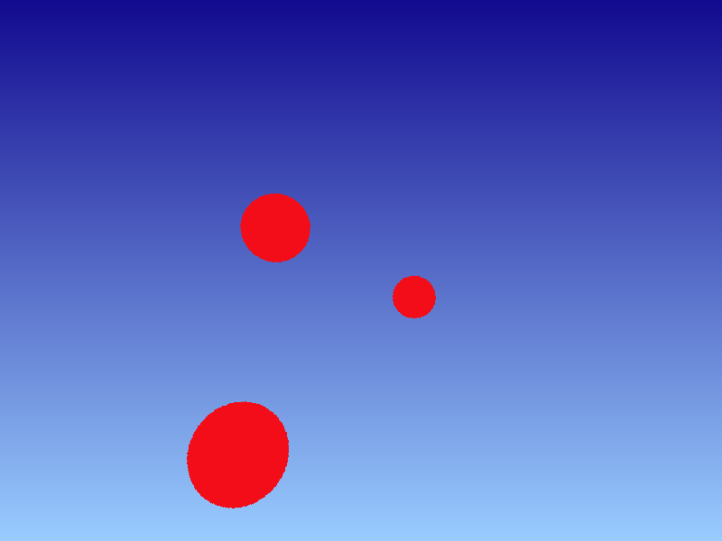
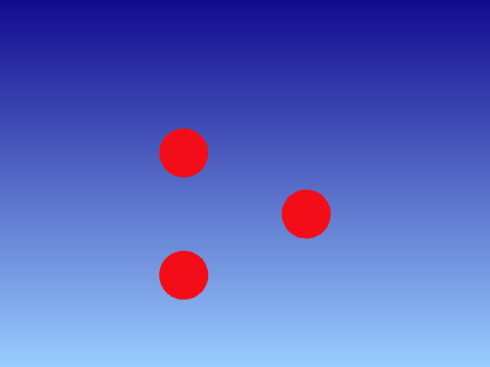

__COMPUTER GRAPHICS I (DIM0451) --  Ray Tracer Project__

# Project 03  - Object-Ray Intersection

In this programming project you will expand your ray tracing project by treating intersection of rays with objects in the scene.

The basic general problem we are trying to solve is:
	
> Given a ray $`\mathbf{r}(t)=\mathbf{o}+\mathbf{\vec{d}}t`$, find the first intersection between $`\mathbf{r}(t)`$ and any surface present in the scene, that happens at $`t`$, in the interval `[tmin, tmax]`.

For that to happen, we need to keep the list of objects present in the scene in a data structure. For now, the easiest solution is to maintain a simple list of an abstract `Primitive` object. Every object that we will support in the ray tracer should be derived from this base `Primitive` class.

The collection of primitives is part of another class, called `Scene`, that should also keep a list of lights presents in the virtual scene. For now, let us make it simple by just creating a basic list of spheres.

The abstract class `Primitive` provides a virtual method to calculate the intersection of that primitive with a ray. This method should be overwritten by any class that derive from `Primitive`, which is the case of the `Sphere` class.

## Intersection Ray-Sphere

The general implicit equation of a surface $`f(\mathbf{p})=0`$ states that any point $`\mathbf{p}`$ that makes this assertion true belongs to the surface. Remember that the parametric ray equation provides an infinite stream of points, given infinite values of $`t`$. Therefore, to find the intersection of a ray with any implicit surface we need to solve $`f(\mathbf{r}(t))=0`$. This means that we need to find out which value of $`t`$ that plugged in the ray equation would result in a 3D point **on** the surface defined by $`f(\mathbf{p})=0`$.

For the specific case of a sphere we have $`f(\mathbf{p})=(\mathbf{p}-\mathbf{c})\cdot(\mathbf{p}-\mathbf{c})-r^2=0`$, which can be geometrically interpreted as _"any point $`\mathbf{p}`$ which squared distance to a point $`\mathbf{c}`$ is equal to squared radius of a sphere is on the sphere's surface."_

If we plug in the ray equation as the $`\mathbf{p}`$  (the unknow) in the sphere's  implicit equation, we have

$`f(\mathbf{r}(t))=(\mathbf{r}(t)-\mathbf{c})\cdot(\mathbf{r}(t)-\mathbf{c})-r^2=0`$

This is a quadratic equation with $`t`$ as the unknown variable. Solving this equation may produce zero, 1 or 2 roots, which corresponds, respectively, to zero, 1 or 2 intersection points.

So, your task is to implement an intersection function for the sphere case that receives a ray, determines the intersection, and returns true if any intersection is found, or false otherwise. More mathematical details of how to compute this intersection might be found [**here**](docs/sphere_ray.pdf).

## Requirements

You should implement the following classes and integrate them into your RT.

1. An abstract class `Primitive` that represents any surface that might be hit by a ray. Any class derived from `Primitive` should provide method to determine intersection of a ray with the surface as well as return a pointer to the material object associated with the surface (not necessary for now). A suggestion for that class is presented next:

```c++
class Primitive {
	public:
		virtual ~Primitive();
		virtual bool intersect( const Ray& r, Surfel *sf ) const = 0;
		// Simpler & faster version of intersection that only return true/false.
		// It does not compute the hit point information.
		virtual bool intersect_p( const Ray& r ) const = 0;
		virtual const Material * get_material(void) const = { return material; }
	private:
		std::shared_ptr<Material> material;
};
```
2. The class `Surfel`[^1] represents the geometry of particular point on a surface (often a position found by intersecting a ray against the surface). This abstraction allows us to pass the contact information along to other parts of the renderer without necessary having to know which object has been hit.
[^1]: In CG jargon, the term _surfel_ represents a point on a 3D surface, in the same way that a _pixel_ represents a point on a 2D image.

```c++
class Surfel{
	public:
		Surfel( const Point&p,const Vector&n, const Vector&wo, float time, 
			const Point2f& uv, const Primitive *pri )
			: p{p}, n{n}, wo{wo}, time{time}, uv{uv}, primitive{pri}
            {/* empty */};

		Point p;        //!< Contact point.
		Vector n;       //!< The surface normal.
		Vector wo;      //!< Outgoing direction of light, which is -ray.
		float time;     //!< Time of contact.
		Point2f uv;     //!< Parametric coordinate (u,v) of the hit surface.
		const Primitive *primitive=nullptr; //!< Pointer to the primitive.
};
```

3. The `Sphere` class that implements a sphere and extends the `Primitive` class.


## The Scene Format & Flat Shader

Here we provide a basic XML format with the `scene` and `sphere` tags included.

```xml
<RT3>
    <lookat look_from="0 0 0" look_at="0 0 10" up="0 1 0" />
    <camera type="perspective" fovy="65" /> 
    <integrator type="flat"/>
    <film type="image" x_res="800" y_res="600" filename="flat_spheres.png" img_type="png" />

    <world_begin/>
        <background type="colors" bl="153 204 255" tl="18 10 143" tr="18 10 143" br="153 204 255" />
        <material type="flat" color="0.95 0.05 0.05" />
        <object type="sphere" radius="0.4" center="-1 0.5 5" />
        <object type="sphere" radius="0.4" center="1 -0.5 8" />
        <object type="sphere" radius="0.4" center="-1 -1.5 3.5" />
    <world_end/>
</RT3>
```

This is the corresponding image, generate by the ray tracer with the _flat_ integrator. This simple integrator just assigns the color stored in the material to the pixel on the screen; this means that the **radiance** (color) returned to the `render()` routine is just a basic color without any light treatment (just yet).

 

Here goes another scene example, this time with _orthographic_ camera:

```xml
<RT3>
    <lookat look_from="0 0 0" look_at="0 0 10" up="0 1 0" />
    <camera type="orthographic" screen_window="-4 4 -3 3"/> 
    <integrator type="flat"/>
    <film type="image" x_res="800" y_res="600" filename="flat_spheres_ortho.png" img_type="png" />

    <world_begin/>
        <!-- The Background -->
        <background type="colors" bl="153 204 255" tl="18 10 143" tr="18 10 143" br="153 204 255" />
        <material type="flat" color="0.95 0.05 0.05" />
        <object type="sphere" radius="0.4" center="-1 0.5 5" />
        <object type="sphere" radius="0.4" center="1 -0.5 8" />
        <object type="sphere" radius="0.4" center="-1 -1.5 3.5" />
    <world_end/>
</RT3>
```

This is the corresponding image, generate by the ray tracer with the _flat_ integrator.

 


In upcoming projects we will modify the representation to enable an hierarchy of objects and to support the specification of geometric transformations associated with each object in the scene.

Next, we provide a modified version of the main loop introduced in the previous project, illustrating a possible usage of the new classes.

```c++
void render( const std::shared_ptr<Scene> s );

int main() {
    // [1] Parser and load scene file, possibly another source file.
    // [2] Create background object.
    std::shared_ptr<Background> bkg = new Background(...);
    // [3] Create current "flat" material
    std::shared_ptr<Material> mat = new FlatMaterial( color );
    // [4] Create spheres
    std::shared_ptr<Primitive> s1 = new Sphere(ps, mat); // ps is the ParamSet with all information regarding a sphere.
    std::shared_ptr<Primitive> s2 = new Sphere(ps, mat);
    std::shared_ptr<Primitive> s3 = new Sphere(ps, mat);
    // [5] Add spheres to list of primitives.
    std::vector< std::shared_ptr<Primitives> > obj_list;
    obj_list.push_back( s1 );
    obj_list.push_back( s2 );
    obj_list.push_back( s3 );
    // [6] Create the camera
    std::shared_ptr<Camera>  cam = std::make_shared<Camera>(ps_camera); // Pass along the ParamSet object with camera information.
    // [7] Create the scene.
    std::shared_ptr<Scene> scene = std::make_shared<Scene>( cam, bkg, obj_list );

    render( scene );
}

void render( const std::shared_ptr<Scene> &s ) {
    // [8] Trace rays...
    auto w = s.camera.film.width(); // Retrieve the image dimensions in pixels.
    auto h = s.camera.film.height();
    // Traverse all pixels to shoot rays from.
    for ( int j = h-1 ; j >= 0 ; j-- ) {
        for( int i = 0 ; i < w ; i++ ) {
            Ray ray = s.camera.generate_ray( i, j ); // Ask the camera to generate a ray.
            ColorXYZ color{0,0,0}; // Default color is black.
            // Get the backgound color in case the ray hits nothing.
            if ( s.background.map_type == Background::mapping_t::screen )
                color = bkg.sample( i/w, j/h ); // screen mapping needs a normalized pixel coord.
            else if ( s.background.map_type == Background::mapping_t::spherical )
                color = bkg.sample( ray ); // spherical mapping needs a ray.
            // Traverse each object of the scene.
            for ( const Primitive& p : s.obj_list ) {
                // Each time the ray hits something, max_t parameter of the ray must be updated.
                if ( p.intersect_p( ray ) ) // Does the ray hit any sphere in the scene?
                    color = ColorXYZ(255,0,0);  // Just paint it red.
            }
            s.camera.film.add( Point2{i,j}, color ); // set image buffer at position (i,j), accordingly.
        }
    }
    // send image color buffer to the output file.
    s.camera.film.write_image();
}
```

## Recommendations

Read the Chapter 4 of [Shirley 2009](#shirley2009).  In particular, Section 4.4 talks about object-ray intersection.

Also, you may need to read the following sections from the "[Physically Based Rendering](https://www.pbr-book.org/3ed-2018/contents)" book, in case you want to better understand the relationship among the classes introduced in this project.

+ Section 2.10
+ Sections 3.1 and 3.2
+ Section 4.1, 4.2 (in this section, just assume that the `Aggregate` class for us is a regular list)

## Extra Credits

To earn extra credits in this project, you have two options, described next.

Consider the spherical coordinate representation of an sphere $`f(\theta,\phi)`$, where $`\theta`$ (elevation) ranges from $`0`$ to $`\pi`$ and $`\phi`$ (azimuth) ranges from $`0`$ to $`2\pi`$, and:

$`\begin{array}{lcl} x & = &r\,\,  \sin{\theta}\,\, \cos{\phi} \\ y & = & r \,\, \sin{\theta}\,\,\sin{\phi}\\z&=&r\,\,\cos{\theta}.\end{array}`$

1. Transform this function $`f(\theta,\phi)`$ into a function $`f(u,v)`$ over $`[0,1]^2`$ and generalize it to support partial spheres that only sweep out $`\theta \in [\theta_{\text{min}},\theta_{\text{max}}]`$ and $`\phi \in [0,\phi_{\text{max}}]`$ with the substitution

$`\begin{array}{lcl} \phi & = &u\,\,\phi_{\text{max}}\\\theta&=&\theta_{\text{min}}+v\,\,(\theta_\text{max}-\theta_{\text{min}}).\end{array}`$

The sphere’s extent can be truncated in two different ways. First, minimum and maximum $`z`$ values may be set; the parts of the sphere below and above these planes, respectively, are cut off. Second, considering the parameterization of the sphere in spherical coordinates, a maximum $`\phi`$ value can be set. The sphere sweeps out $`\phi`$ values from $`0`$ to the given $`\phi_{\text{max}}`$ such that the section of the sphere with spherical $`\phi`$ values above $`\phi_{\text{max}}`$ is also removed.

```c++
\\=== Sphere private data:
	const float radius;
	const float z_min, z_max;
	const float theta_min, theta_max, phi_max;
```

2. Implement intersection with other shapes, such as triangles and planes. Assume that the plane object is a square with 2 unit length edges. It is placed at the origin and the plane normal is aligned with the positive z-axis in object coordinates. In future project we will be able to modify the size of the plane as well as to place it  anywhere in the scene by means of geometric transformations.

### References

<A name="shirley2009"></A>
* P. Shirley and S. Marschner., "Fundamentals of Computer Graphics", 3rd ed., 2009, A K Peters.
